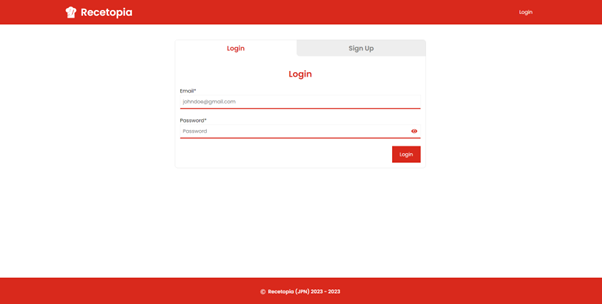
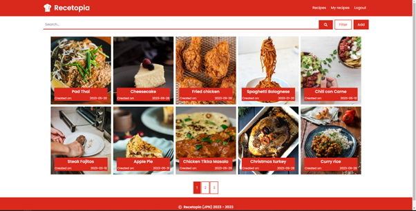
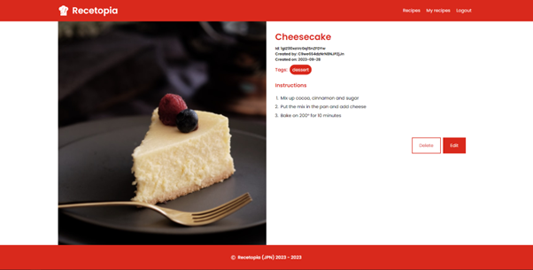

# Recetopia - get recipes quick and easy

Recetopia is a web application built with React and Redux. The platform was designed for easy access to recipes, as well as easy recipe management.

<p align="center"></p>
<p align="center"></p>
<p align="center"></p>

## Table of contents

- [Features](#features)
- [Implemented libraries and frameworks](#implemented)
- [Live demo](#demo)
- [How to run the app locally](#local)
  - [Clone the repository](#clone)
  - [Enter project directory](#dir)
  - [Install the dependencies](#dependencies)
  - [Setup the API keys](#api)
  - [Start the app](#start)
- [Test environment](#test)
- [Contribution](#contribution)
- [Licence](#licence)
- [Contact](#contact)

## Features <a name="features" />

- Login/Sign Up: Create an account to show recipes and manage your own recipes
- Search with recipe name / search with tags: Find the recipe you are looking for using the tags and recipe name
- Manage recipes: Easily create, update or delete recipes

## Implemented libraries and frameworks <a name="implemented" />

- [React](https://react.dev/learn)
- [Redux](https://redux.js.org/introduction/getting-started)
- [Axios](https://axios-http.com/docs/intro)
- [React Toastify](https://www.npmjs.com/package/react-toastify)
- [React intersection observer](https://www.npmjs.com/package/react-intersection-observer)

## Live demo <a name="live" />

You can find the web app up and running by visiting the [live demo](https://recetopia.netlify.app)

## How to run the app locally <a name="local" />

if you want to run the app following:

#### 1. Clone the repository <a name="clone" />

- HTTS:

```bash
git clone https://github.com/Zack1808/recetopia.git
```

- SSH:

```bash
git clone git@github.com:Zack1808/recetopia.git
```

- Git CLI:

```bash
gh repo clone Zack1808/recetopia
```

#### 2. Enter the project directory <a name="dir" />

```bash
cd recetopia
```

#### 3. Install the dependencies <a name="dependencies" />

```bash
npm install
```

or

```bash
yarn install
```

#### 4. Setup the API keys <a name="api" />

Within the project directory create a .env file. In there, create the following variables

```
REACT_APP_AUTHID=yourAuthId
REACT_APP_UNSPLASH_KEY=yourUnsplashApiKey
```

#### 5. Start the app <a name="start" />

```bash
npm start
```

or

```bash
yarn start
```

After execution, the localhost server will start up and a browser window will open, previewing the web app.

## Test environment <a name="test" />

You can create a new account using the signup tab, however for convenience you can use the following credentials:

- Email:

```
johndoe@gmail.com
```

- Password:

```
adminLogin1!
```

## Contribution <a name="contribution" />

Contributions to the project are welcome. If you find any issues or want to add new features, feel free to create a pull request. Make sure to follow the project's coding conventions and provide detailed information about your changes.

## Licence <a name="licence" />

[MIT](https://github.com/Zack1808/recetopia/blob/master/LICENSE)

## Contact <a name="contact" />

If you have any questions or suggestions, you can reach me via:

- Mail: jeanpierrenovak23@gmail.com
- My portfolio: [jeanpierrenovak.netlify.app](https://jeanpierrenovak.netlify.app)

---

Happy cooking!
